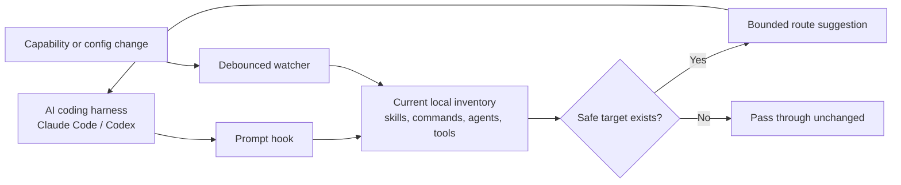

# Claude Router

Claude Router is a zero-dependency local prompt router for AI coding harnesses such as Claude Code and Codex.

## Why it exists

An AI coding harness can only use the capabilities that are installed and available in its current environment. Skills, commands, agents, hooks, and project configuration change over time. Static routing quickly becomes stale, and guessing a route can be worse than leaving a prompt untouched.

Claude Router keeps a current local inventory, suggests only routes that resolve to real capabilities, and repairs its routing state when the environment changes.

## What it does

- Discovers capabilities available to the current harness environment.
- Keeps Claude Code and Codex routing artifacts separate and runtime-local.
- Matches prompt intent against the current inventory instead of a hard-coded list.
- Adds a bounded suggestion through the harness prompt hook when a safe target exists.
- Watches capability and configuration changes and rebuilds routing state after a debounce.
- Ties calibration and cached decisions to the current inventory fingerprint.
- Leaves unsafe, incomplete, stale, or ambiguous candidates inactive.

The harness remains in control. Claude Router suggests a route; it does not replace the harness approval flow or silently run the task.

## How it works

The complete flow is:



1. A harness sends a prompt to its normal prompt hook.
2. The router reads the inventory for that runtime and the relevant project.
3. The registry resolves possible targets and applies safety and availability checks.
4. If a valid target exists, the router adds a small, bounded suggestion.
5. If no valid target exists, the prompt passes through without a fabricated route.
6. In the background, the watcher notices capability changes, rebuilds the inventory, and reconciles candidates before they become active.

This is local-first software. It uses Node's standard library and needs no package manager, hosted service, database, container, or external control plane.

## What it does not do

- It does not install plugins, MCP servers, tools, models, skills, commands, or agents.
- It does not invent missing capabilities.
- It does not silently dispatch work.
- It does not overwrite unrelated user configuration.
- It does not activate malformed or untrusted routing candidates.

## Requirements

- Node.js with ES module support; a current LTS release is recommended.
- At least one supported AI coding harness installed locally: Claude Code or Codex.

There is no `npm install` step.

## Install

Clone the repository and run the lifecycle entry point:

```bash
git clone https://github.com/Guilherme1612/claude-router.git
cd claude-router
node install-router.mjs
```

The installer is idempotent. It installs or repairs only Claude Router-owned hooks, runtime modules, manifests, controller state, and related files. Existing unrelated user configuration is preserved.

For a project-specific capability root:

```bash
node install-router.mjs --project-root /path/to/project
```

Preview candidate changes without writing:

```bash
node install-router.mjs --dry-run
```

## Use and lifecycle commands

After installation, use your harness normally. The router hook runs automatically and only adds a suggestion when it can resolve a safe target.

```bash
node install-router.mjs --help
node install-router.mjs --restart-controller
node install-router.mjs --uninstall
```

- `--help` prints all supported options.
- `--restart-controller` restarts the owned watcher after a recoverable controller issue.
- `--uninstall` removes only files and hook entries proven to be owned by Claude Router. Modified or ambiguous state is retained and reported.

The default runtime roots are `~/.claude` and `~/.codex`. Advanced path overrides are available through `--claude-root`, `--codex-root`, `--source-router`, `--settings`, `--router`, `--manifest`, and `--node-binary`.

## Safety model

- Prompt-time routing is bounded and read-only.
- Each harness keeps its own runtime-local artifacts.
- Route targets are existence-checked before they can be suggested.
- File changes are debounced and reconciled before activation.
- Invalid, stale, or untrusted candidates remain inactive.
- Uninstall is ownership-aware and refuses to delete ambiguous state.
