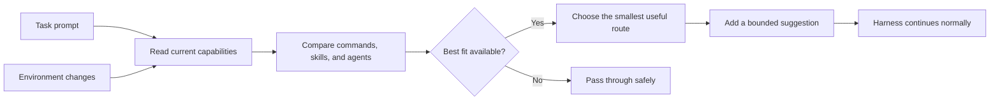

# Claude Router

Claude Router is a local decision layer for AI coding harnesses such as Claude Code and Codex.

Its main goal is simple: for each task, help the harness choose the best available way to do the work.

That can be a command, skill, agent, workflow, or no route at all. The router checks what is really installed, chooses the best fit, and keeps the suggestion small and safe.

## Why it exists

An AI coding harness often has many commands, skills, and agents to choose from. If it chooses badly, it can:

- spend tokens looking for the right tool;
- use a broad agent when a small command would be enough;
- repeat work or load unnecessary context;
- use a stale route that no longer exists;
- waste time before the real task starts.

Claude Router makes that choice earlier and closer to the prompt. It uses the current local environment instead of guessing from an old list.

## What it helps with

- **Better choices:** find the command, skill, or agent that best matches the task.
- **Lower token use:** avoid unnecessary exploration, duplicate routes, and oversized suggestions.
- **Faster work:** keep the prompt-time decision small and use the narrowest useful route.
- **Less maintenance:** notice when capabilities change and refresh routing automatically.
- **Safer behavior:** never suggest a target that is missing, unsafe, stale, or ambiguous.
- **Graceful fallback:** when there is no good match, let the harness handle the prompt normally.

The router is designed to improve the path to the answer, not to do the answer itself.

## How it works



1. The harness receives a normal prompt.
2. Claude Router reads the current local inventory for that runtime and project.
3. It compares the task with available commands, skills, agents, and workflows.
4. It selects the best useful option, while avoiding unnecessary composition.
5. It adds a bounded suggestion when the route is safe and real.
6. If no good route exists, it does nothing and the prompt passes through.
7. A background watcher refreshes the inventory when the environment changes.

Claude Router is local-first. It uses Node's standard library and needs no hosted service, database, container, or external control plane.

## What it does not do

- It does not install plugins, MCP servers, tools, models, skills, commands, or agents.
- It does not invent capabilities that are not installed.
- It does not silently run the task.
- It does not replace the harness approval flow.
- It does not overwrite unrelated user configuration.

The harness remains in control. Claude Router improves the choice of approach; the harness still performs the work.

## Requirements

- Node.js with ES module support; a current LTS release is recommended.
- At least one supported AI coding harness installed locally: Claude Code or Codex.

There is no `npm install` step.

## Install

Clone the repository and run the lifecycle entry point:

```bash
git clone https://github.com/Guilherme1612/claude-router.git
cd claude-router
node install-router.mjs
```

The installer is idempotent. It installs or repairs only Claude Router-owned hooks, runtime modules, manifests, controller state, and related files. Existing unrelated user configuration is preserved.

For a project-specific capability root:

```bash
node install-router.mjs --project-root /path/to/project
```

Preview candidate changes without writing:

```bash
node install-router.mjs --dry-run
```

To uninstall Claude Router-owned state:

```bash
node install-router.mjs --uninstall
```

## Safety model

- Prompt-time routing is bounded and read-only.
- Each harness keeps its own runtime-local artifacts.
- Route targets are checked before they can be suggested.
- File changes are debounced and reconciled before activation.
- Invalid, stale, or untrusted candidates remain inactive.
- Uninstall is ownership-aware and refuses to delete ambiguous state.