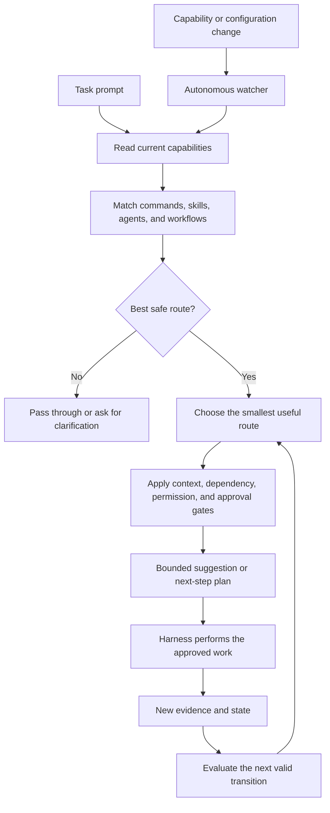

# Claude Router

Claude Router is an autonomous, bounded decision layer for AI coding harnesses such as Claude Code and Codex.

Its job is to help the harness choose the best available way to handle each task, then keep that choice current as the environment changes.

It can select a command, skill, agent, or workflow. It can also decide that no route is safe or useful and leave the prompt alone.

## The main goal

Give every task the smallest useful path to a good result.

Claude Router looks at the current local capabilities and asks:

- Which command, skill, agent, or workflow fits this task best?
- Can a smaller or faster option do the job?
- What context is actually needed?
- Is the next step supported by real evidence?
- Does the action need dependency, permission, or user approval?

This helps reduce wasted tokens, slow exploration, repeated work, unnecessary context, and stale routes.

## Why it exists

AI coding harnesses often have many ways to solve the same problem. Without a decision layer, a harness may search too broadly, use a large agent for a small task, load context it does not need, or follow a route that no longer exists.

Claude Router makes the choice close to the prompt. It uses the current environment instead of guessing from an old list, and it keeps the routing state up to date in the background.

## What it helps with

- **Better choices:** select the best available command, skill, agent, or workflow.
- **Lower token use:** keep suggestions and context bounded and avoid duplicate exploration.
- **More speed:** prefer the narrowest useful route and keep the prompt-time path small.
- **Continuous maintenance:** refresh inventories and routing state when capabilities or configuration change.
- **Autonomous progress:** evaluate supported next steps from current evidence instead of guessing.
- **Safer execution:** block missing dependencies, incomplete permissions, risky side effects, and ambiguous transitions.
- **Graceful fallback:** pass the prompt through or ask for clarification when there is no safe answer.

The router improves the path to the answer. The harness still performs the work.

## How it works



1. The harness receives a normal prompt.
2. The router reads the current inventory for that runtime and project.
3. It matches the task to available capabilities.
4. It chooses a useful route only when the target and its dependencies are real.
5. It limits the context and output used for the decision.
6. The harness receives a bounded suggestion or next-step plan.
7. New evidence can support the next valid workflow transition.
8. A background watcher refreshes routing state when the environment changes.

## The autonomous part

Autonomous does not mean uncontrolled.

Claude Router can work continuously in the background to:

- watch local capability and configuration roots;
- rebuild manifests and route indexes after changes;
- reconcile new candidates before they become active;
- identify valid next workflow transitions from current evidence;
- select and prepare a bounded context load;
- keep state, fingerprints, and route decisions consistent.

It stops when a required fact is missing, several transitions are equally valid, a dependency is unavailable, or an action needs permission or approval. It does not run arbitrary tasks or destructive actions silently.

## Token and speed focus

Claude Router is designed to make routing cheaper and faster:

- local checks happen before broad exploration;
- route suggestions stay bounded;
- the narrowest useful capability is preferred;
- known summaries and current state can be reused;
- context has explicit size limits;
- dependency and approval checks happen before expensive or risky work;
- route state is refreshed in the background instead of rediscovered on every prompt.

It cannot guarantee the perfect route every time. Its purpose is to make the choice fast, small, explainable, and safe.

## What it does not do

- It does not install plugins, MCP servers, tools, models, skills, commands, or agents.
- It does not invent capabilities that are not installed.
- It does not replace the harness approval flow.
- It does not silently run destructive, external, privileged, or unbounded work.
- It does not overwrite unrelated user configuration.
- It does not remove Claude Code, Codex, or your installed capabilities during uninstall.

## Requirements

- Node.js with ES module support; a current LTS release is recommended.
- At least one supported AI coding harness installed locally: Claude Code or Codex.

There is no `npm install` step.

## Install

Clone the repository and run the lifecycle entry point:

```bash
git clone https://github.com/Guilherme1612/claude-router.git
cd claude-router
node install-router.mjs
```

The installer is idempotent. It installs or repairs only Claude Router-owned hooks, runtime modules, manifests, controller state, and related files. Existing unrelated user configuration is preserved.

For a project-specific capability root:

```bash
node install-router.mjs --project-root /path/to/project
```

Preview candidate changes without writing:

```bash
node install-router.mjs --dry-run
```

## Uninstall

From the repository root, run:

```bash
node install-router.mjs --uninstall
```

The installer removes only files, hooks, and state that Claude Router can prove it owns. Modified or ambiguous files are kept and reported. Claude Code, Codex, and your installed capabilities are not removed.

## Safety model

- Prompt-time routing is bounded and read-only.
- Each harness keeps its own runtime-local artifacts.
- Route targets and dependencies are checked before they can be suggested.
- Context, permission, and approval gates run before risky work.
- File changes are debounced and reconciled before activation.
- Invalid, stale, or untrusted candidates remain inactive.
- Uninstall is ownership-aware and refuses to delete ambiguous state.
