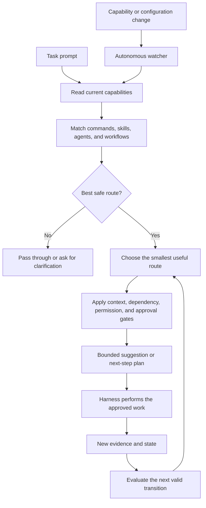

# Claude Router

Claude Router is a zero-dependency, framework-neutral local routing layer for Claude Code and Codex. It discovers and maps available local capabilities—hooks, commands, agents, skills, tools, and integrations—and only resolves targets that are valid in the active runtime.

Current release: v2.4 — Universal Capability Onboarding and Evidence-Driven Routing.

It chooses the smallest safe command, skill, agent, or workflow from capabilities that actually exist in the current runtime and project. If evidence is missing or the target is not dispatchable, it recommends, passes through, or asks for clarification instead of fabricating a route.

## The main goal

Give every task the smallest useful path to a good result.

Claude Router looks at the current local capabilities and asks:

- Which command, skill, agent, or workflow fits this task best?
- Can a smaller or faster option do the job?
- What context is actually needed?
- Is the next step supported by real evidence?
- Does the action need dependency, permission, or user approval?

This helps reduce wasted tokens, slow exploration, repeated work, unnecessary context, and stale routes.

## Why it exists

AI coding harnesses often have many ways to solve the same problem. Without a decision layer, a harness may search too broadly, use a large agent for a small task, load context it does not need, or follow a route that no longer exists.

Claude Router makes the choice close to the prompt. It uses the current environment instead of guessing from an old list, and it keeps routing state up to date as capabilities or configuration change.

## What it helps with

- **Better choices:** select the best available command, skill, agent, or workflow.
- **Evidence-backed routing:** keep missing, stale, ambiguous, or untrusted targets inactive.
- **Lower token use:** keep suggestions and context bounded and avoid duplicate exploration.
- **More speed:** prefer the narrowest useful route and keep the prompt-time path small.
- **Continuous maintenance:** refresh inventories and routing state when capabilities or configuration change.
- **Safer execution:** block missing dependencies, incomplete permissions, risky side effects, and ambiguous transitions.
- **Graceful fallback:** pass the prompt through or ask for clarification when there is no safe answer.

The router improves the path to the answer. The harness still performs the work.

## How it works



1. The harness receives a normal prompt.
2. The router reads the current inventory for that runtime and project.
3. It matches the task to available capabilities.
4. It validates the target, dependencies, permissions, and approval requirements.
5. It chooses a useful route only when the evidence supports it.
6. It limits the context and output used for the decision.
7. New evidence can support the next valid workflow transition.
8. A background watcher refreshes routing state when the environment changes.

## The autonomous part

Autonomous does not mean uncontrolled.

Claude Router can work continuously in the background to:

- watch local capability and configuration roots;
- rebuild manifests and route indexes after changes;
- reconcile new candidates before they become active;
- identify valid next workflow transitions from current evidence;
- select and prepare a bounded context load;
- keep state, fingerprints, and route decisions consistent.

It stops when a required fact is missing, several transitions are equally valid, a dependency is unavailable, or an action needs permission or approval. It does not run arbitrary tasks or destructive actions silently.

## Runtime and privacy boundary

Claude Router is local-first and uses Node.js standard-library runtime code. No hosted classifier or npm installation step is required.

- Claude and Codex keep separate runtime-local inventories, route decisions, and state.
- The optional local observer is marker-gated and fails open when disabled or unavailable.
- Observer records remove raw prompts and private execution fields such as working directories, transcript paths, tool input, tool output, and downstream output.
- Session correlation uses short pseudonymous hashes rather than raw session identifiers.
- Unknown or incomplete capabilities remain recommendation-only or quarantined until their evidence and authority are sufficient.

## Token and speed focus

Claude Router is designed to make routing cheaper and faster:

- local checks happen before broad exploration;
- route suggestions stay bounded;
- the narrowest useful capability is preferred;
- known summaries and current state can be reused;
- context has explicit size limits;
- dependency and approval checks happen before expensive or risky work;
- route state is refreshed in the background instead of rediscovered on every prompt.

It cannot guarantee the perfect route every time. Its purpose is to make the choice fast, small, explainable, and safe.

## What it does not do

- It does not install plugins, MCP servers, tools, models, skills, commands, or agents.
- It does not invent capabilities that are not installed.
- It does not replace the harness approval flow.
- It does not silently run destructive, external, privileged, or unbounded work.
- It does not overwrite unrelated user configuration.
- It does not remove Claude Code, Codex, or your installed capabilities during uninstall.

## Requirements

Node.js 20+ and at least one installed Claude Code or Codex runtime. No npm install step is required; the project uses Node's standard library.

## Install

Requirements: Node.js 20+ and at least one installed Claude Code or Codex runtime. There is no `npm install` step; the project uses Node's standard library.

Clone the repository and provide one or both runtime roots plus an external neutral state root. Omit the runtime option for a runtime that is not installed:

```bash
git clone https://github.com/Guilherme1612/claude-router.git
cd claude-router

node install-router.mjs \
  --claude-root /path/to/claude-runtime \
  --codex-root /path/to/codex-runtime \
  --state-root /path/to/router-state
```

Use only the runtime root that exists. The state root must be explicit, outside this repository and the runtime roots, and must not be named `.router`.

Equivalent environment variables are `CLAUDE_CONFIG_ROOT`, `CODEX_CONFIG_ROOT`, and `ROUTER_STATE_ROOT`.

Preview without writing:

```bash
node install-router.mjs --dry-run \
  --claude-root /path/to/claude-runtime \
  --state-root /path/to/router-state
```

Remove only Router-owned bindings and files:

```bash
node install-router.mjs --uninstall \
  --claude-root /path/to/claude-runtime \
  --codex-root /path/to/codex-runtime \
  --state-root /path/to/router-state
```

## Runtime behavior

The default route is safe pass-through. `UserPromptSubmit` remains untouched unless the owner has supplied an explicit neutral capability manifest. `SessionStart`, `Stop`, and `PreCompact` can receive a short status containing what is done, current, blocked, next, route, and owner action.

For explicit neutral selection, create `capabilities.json` under the state root:

```json
{
  "schema_version": 1,
  "capabilities": [
    {
      "id": "data-inspector",
      "keywords": ["data", "relationship"],
      "runtimes": ["claude", "codex"],
      "enabled": true,
      "state": "dispatchable",
      "dispatchable": true,
      "invocation": { "method": "native", "target": "data-inspector" },
      "authority": { "kind": "owner-controlled" }
    }
  ]
}
```

Selection is deterministic and owner-controlled; it provides a route signal and does not execute a command. Metadata-only or malformed entries remain pass-through or recommendation-only. The manifest may also use the normalized `records` root and `stable_id` identifiers. The event log stores lifecycle type, runtime, hashes, timestamps, route state, and bounded counts. It does not store raw prompts, working-directory paths, or downstream output.

## Safety and portability

- No home-directory discovery or personal framework assumptions.
- No dependency on GSD, Superpowers, GStack, Graphify, or any other plugin collection.
- Claude and Codex keep separate runtime-local hook bindings.
- Existing unrelated hooks and settings are preserved.
- Installation records ownership and fingerprints so uninstall removes only Router-owned state.
- Prompt-time work is read-only; mutations fail closed and preserve last-known-good state.

The adaptive registry, continuity, health, orchestration, and bounded-autonomy implementation lives under `src/`. The public installer deliberately keeps the installed bridge neutral and explicit so it can run on arbitrary Claude/Codex layouts.

## Development

Run the tests with Node's built-in runner:

```bash
node --test --test-concurrency=1 tests/*.test.mjs
```

The public entry point is `install-router.mjs`. No package manager or hosted control plane is required.

Verify both runtime paths locally:

```bash
node scripts/v24-evaluate.mjs
ROUTER_EVAL_RUNTIME=codex node scripts/v24-evaluate.mjs
```
